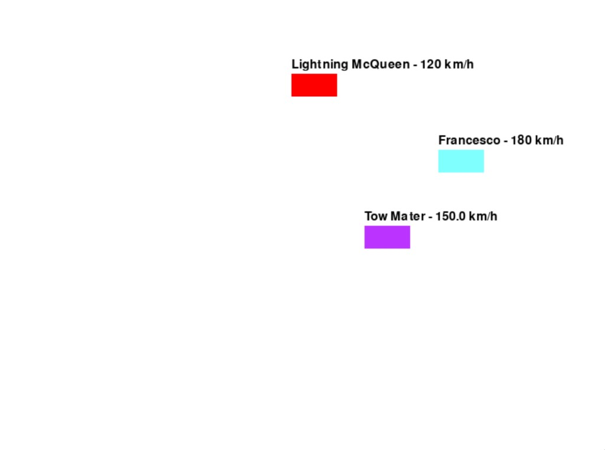

# 🐍 Python OOP — Semester 2 Coursework

Coursework from **2nd semester** of **Software Development Engineering** (Ingeniería en Desarrollo de Software) at Universidad Tecmilenio.

These scripts are the programming assignments I delivered for the **Object-Oriented Programming** course. They are small, self-contained demos — not a production application.

**Author:** José Alberto Rocha Munguía

---

## 📂 Contents

| File | Topic |
|---|---|
| `conditionals_demo.py` | `if` / `elif` / `else` |
| `while_loop_demo.py` | `while` loops |
| `math_functions_demo.py` | Functions (`int`, modulo) |
| `hogwarts_oop_demo.py` | Classes, inheritance, polymorphism |
| `hogwarts_characters.py` | Classes with composition (`Wand`) |
| `guessing_game.py` | Hangman-style game (OOP + input) |
| `pokemon_battle.py` | Turn-based battle (types, defend) |
| `car_race_game.py` | Simple race with **pygame** |

---

## 🛠 Requirements

- Python **3.10+** recommended  
  - Tested with **Python 3.13 (Anaconda)**  
  - **Python 3.14** may fail to install pygame until wheels are available
- pygame (only for `car_race_game.py`) — see `requirements.txt`

```bash
python3 -m venv .venv
source .venv/bin/activate          # Windows: .venv\Scripts\activate
python -m pip install -r requirements.txt
```

If you already use Anaconda with pygame installed:

```bash
python car_race_game.py
```

---

## 🚀 How to run

From the repository root:

```bash
python conditionals_demo.py
python while_loop_demo.py
python math_functions_demo.py
python hogwarts_oop_demo.py
python hogwarts_characters.py
python guessing_game.py
python pokemon_battle.py
python car_race_game.py
```

Interactive scripts (`guessing_game.py`, `pokemon_battle.py`) ask for keyboard input.  
`car_race_game.py` opens a window; the first car past the finish line wins.

### 🏎 Car race demo



---

## 📝 Notes

- Comments and identifiers are in English for consistency on GitHub.
- Each file is independent; there is no shared package layout.
- Local virtual environments (`.venv/`) are ignored via `.gitignore`.
